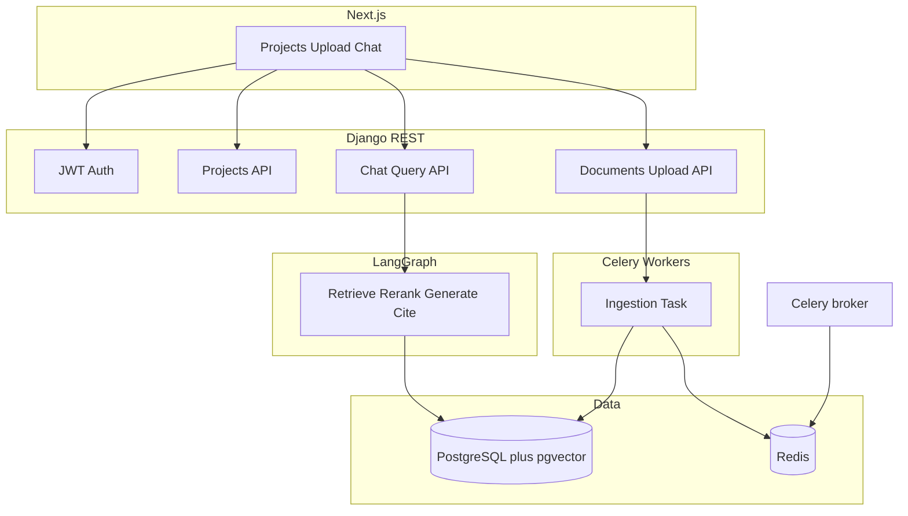

# Scalable LangGraph RAG Research Assistant (Django + Next.js + PostgreSQL)

## Context

The workspace [ASE2026](education/ASE2026/README.md) is empty aside from a stub README—this plan assumes **new** `backend/` (Django) and `frontend/` (Next.js) plus [docker-compose.yml](education/ASE2026/docker-compose.yml) at the repo root.

## Architecture decisions (recommended defaults)


| Concern          | Choice                                                                           | Rationale                                                                                                                                                       |
| ---------------- | -------------------------------------------------------------------------------- | --------------------------------------------------------------------------------------------------------------------------------------------------------------- |
| Vector storage   | **PostgreSQL + pgvector**                                                        | One Docker service for relational + vectors; `WHERE project_id = ?` maps cleanly; horizontal scaling later via read replicas / dedicated vector tier if needed. |
| Async ingestion  | **Celery + Redis**                                                               | PDF/DOCX parsing and embedding are slow; API returns quickly with `document.status` (`pending` → `processing` → `ready` / `failed`).                            |
| Auth             | **Django + JWT** (e.g. `djangorestframework-simplejwt`)                          | Fits “user logs in”; Next.js stores access token; API is stateless.                                                                                             |
| LLM / embeddings | **Env-configured** (OpenAI or compatible API first)                              | Simplest path to quality; optional second path: local `sentence-transformers` + Ollama documented as variants.                                                  |
| Re-ranking       | **Cross-encoder** (e.g. `sentence-transformers` small model) or **API reranker** | Spec calls re-rank “critical”; start with a local cross-encoder to avoid extra paid dependency, swap to Cohere/Voyage if you prefer.                            |





## 1. Docker and PostgreSQL

- **Compose services**: `db` (image `pgvector/pgvector:pg16` or official Postgres + init script enabling `pgvector`), `redis`, `backend` (Django + Gunicorn/Uvicorn worker if using ASGI), `worker` (Celery), optional `frontend` for prod or document `npm run dev` on host.
- **Env**: `DATABASE_URL`, `REDIS_URL`, `SECRET_KEY`, `LLM_*`, `EMBEDDING_*`, `CORS_ALLOWED_ORIGINS` for Next.js.
- **Django**: `django-environ` or similar; migrations create extensions (`CREATE EXTENSION vector`) via `RunSQL` in initial migration or entrypoint script.

## 2. Django backend layout

Suggested apps (single repo `backend/`):

- `**users`** (optional thin wrapper): registration/login if not using django-allauth; JWT obtain/refresh endpoints.
- `**projects`**: `Project` (`id`, `owner` FK → User, `name`, `created_at`). All retrieval scoped by `project_id` + ownership checks.
- `**documents**`: `Document` (`project`, `original_filename`, `stored_path` or S3 key later, `mime_type`, `status`, `error_message`, `page_count` optional).
- `**rag` or `knowledge**`: `DocumentChunk` with `document` FK, `chunk_index`, `content`, `token_count`, `page_number`, `metadata` JSONField; **pgvector column** `embedding vector(N)` where `N` matches embedding model dimension. Index: IVFFlat or HNSW on `(project_id)` + vector (Django-pgvector / raw SQL as needed).
- `**chat`**: `Conversation` (optional: one per project session) or flat `ChatMessage` with `project`, `role` (`user`/`assistant`), `content`, `citations` JSONField, `created_at` for “project-level memory.”

**API surface (REST, JSON):**

- `POST /api/auth/register`, `POST /api/auth/token`, refresh.
- `GET/POST /api/projects/`, `GET/PATCH/DELETE /api/projects/{id}/`.
- `POST /api/projects/{id}/documents/` (multipart upload) → creates `Document`, enqueues Celery task, returns `document_id` + `status`.
- `GET /api/projects/{id}/documents/` (list + status).
- `POST /api/projects/{id}/chat/` body: `{ "message": "..." }` → runs LangGraph synchronously (or SSE/streaming in a follow-up); returns `{ answer, citations[], message_id }`.
- `GET /api/projects/{id}/chat/messages/` for history pagination.

**Security**: every endpoint validates `request.user` owns the `project_id` (object-level permissions).

## 3. Ingestion pipeline (Celery task)

Aligned with your §3.2:

1. Load file from storage; detect PDF vs DOCX.
2. **Extract**: `pypdf` or `pdfplumber` (PDF), `python-docx` (DOCX); track **page_number** per span where possible.
3. **Chunk**: LangChain `RecursiveCharacterTextSplitter` or equivalent with `chunk_size` / `chunk_overlap` targeting **300–500 tokens** (use `tiktoken` for token-accurate splits).
4. **Metadata** per chunk: `project_id`, `document_id`, `document_name`, `page_number`, `chunk_id` (stable: e.g. `{document_id}:{chunk_index}`).
5. **Embed** batch chunks; **upsert** rows in `DocumentChunk` with vectors.
6. Update `Document.status = ready` (or `failed` with log).

## 4. LangGraph query pipeline (§3.3)

Implement as a **pure Python module** (e.g. `backend/rag/graph.py`) invoked from the chat view/service—keeps graph testable without HTTP.

**State** (TypedDict or Pydantic):

- `project_id`, `user_id` (for auth context only, not passed to LLM), `query`, `chat_history` (trimmed window), `retrieved_chunks`, `reranked_chunks`, `final_answer`, `citations`.

**Nodes (linear graph matching your §4):**

1. **LoadMemory** – load last N messages for `project_id` from DB into `chat_history`.
2. **EmbedQuery** – single query vector (same model as ingestion).
3. **Retrieve** – SQL / ORM: `ORDER BY embedding <=> query_embedding LIMIT 10` with `**WHERE project_id = %s`** (and join document for name).
4. **Rerank** – cross-encoder scores query vs chunk text; keep **top 3** (configurable).
5. **AggregateMultiDoc** – group by `document_id`, build context blocks (document title + ordered snippets) for multi-file reasoning.
6. **Generate** – single LLM call with system prompt: use only context; if insufficient, respond that the answer was not found; allow follow-ups using `chat_history`.
7. **FormatCitations** – enforce structure `[DocumentName – Page N]` from chunk metadata; optionally dedupe.
8. **SaveMemory** – persist user message + assistant message + `citations` JSON.

**Edges**: linear `START → ... → END`; add **conditional edge** later only if you want “no retrieval → skip generate” optimization.

**Reliability**: try/except around LLM; on failure return graceful error JSON and log; optional retry node (out of scope for minimal v1).

## 5. Next.js frontend

- **App Router**, TypeScript, `fetch` to Django with `Authorization: Bearer`.
- **Pages**: login/register; project list/create; project detail with **document list** (poll or refresh status after upload); **chat panel** showing assistant markdown, citation list, and history.
- **Upload**: `FormData` to documents endpoint; show processing state.
- **CORS**: Django `django-cors-headers` restricted to dev/prod origins.

## 6. Scalability and ops (your §7)

- **Horizontal**: multiple Celery workers; stateless API behind load balancer; Postgres connection pooling (PgBouncer) when traffic grows.
- **Performance**: batch embeddings on ingest; HNSW index tuning; cache query embeddings only if you add repeat-query optimization.
- **Observability**: structured logging on graph steps; store `latency_ms` per chat request optionally.

## 7. Repository layout (suggested)

```text
ASE2026/
  docker-compose.yml
  backend/
    manage.py
    config/                 # settings, urls, celery.py
    apps/users|projects|documents|chat|rag/
    rag/graph.py            # LangGraph
    rag/prompts.py
  frontend/
    app/ ...
```

## 8. Dependencies (backend, concise)

- Django, DRF, `djangorestframework-simplejwt`, `django-cors-headers`, `celery`, `redis`, `psycopg[binary]`, `pgvector` (Python client) or `django-pgvector` if stable for your Django version.
- LangChain (text splitters, optional LLM adapters), **LangGraph**.
- `pypdf`/`pdfplumber`, `python-docx`, `tiktoken`.
- `sentence-transformers` (embeddings and/or reranker) or OpenAI SDK.

## 9. Implementation order

1. Docker Compose + Django project + Postgres/pgvector + JWT auth smoke test.
2. `Project` CRUD + Next.js auth + project UI.
3. Document model + upload API + Celery ingestion + chunk table with vectors.
4. LangGraph pipeline + chat API + persistence of messages.
5. Next.js chat UI + citations rendering.
6. Hardening: indexes, error handling, basic logging, README with env template.

## Risks / follow-ups (non-blocking)

- **Page numbers for DOCX**: approximate by paragraph index or section if true page mapping is weak.
- **Streaming answers**: add SSE or WebSocket after core path works.
- **Large files**: add max size limits and optional object storage (S3/MinIO) later.

